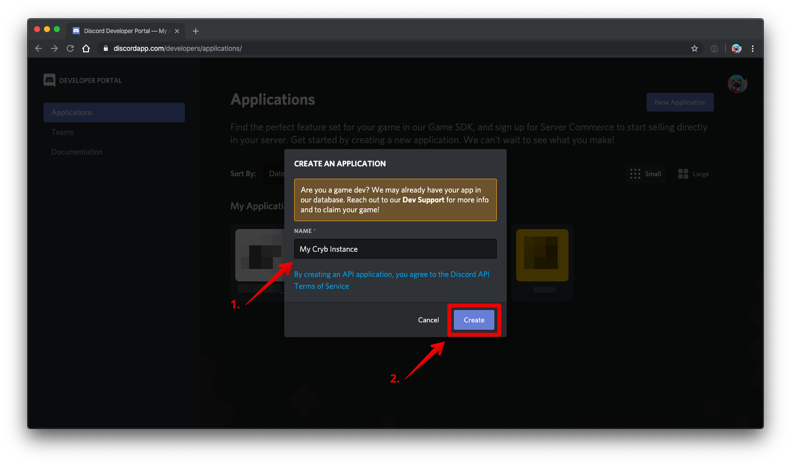

# Setting up Discord Integration
Currently, Cryb relies on `Login with Discord` for initial authentication. This guide will tell you how to setup a [Discord](https://discordapp.com) application for use with Cryb.

## Docs
* [Creating an application](#creating-an-application)
* [Setting up Oauth2](#setting-up-oauth2)
* [Next step](#next-step)

## Creating an application
*If you don't have a Discord account, you can sign up [here](https://discordapp.com/register).*

First of all, we need to create a Discord application. This will allow us to authenticate users with the Discord API, creating a seamless login experiance.

Go to https://discordapp.com/developers/applications in your browser, and click 'New Application' in the top right.

You'll want to give your application a name. Once you're done, just click 'Create'.

Now you've successfully created a Discord application! You'll be able to see your Discord client id and client secret here, make sure to keep these copied somewhere as you'll need them later.

You can also give your application a special icon if you want, but you don't have to.

**Footnotes**
* You'll want to copy the client ID and client secret to the environment variables in `@cryb/api`.
* **Never share your Discord Client Secret with anyone, even if they say they're from Discord or Cryb. This will let anyone pretend to be any user on your Cryb instance, or worse.**

## Setting up Oauth2
Next, let's setup the Oauth2. Click 'Oauth2' on the side tab bar, and then 'Add Redirect' under the 'Redirects' section.

You'll want to enter any URLs that your Cryb instance can be accessed on here, followed by `/auth/discord`.

Add `http://localhost:3000/auth/discord`, which will be used when you're running Cryb locally. You can also add other URLs here, such as a domain. Once you've added your redirect URIs, just press 'Save Changes' and you're done!

## Next step
Now you can setup Cryb with the platform of your choice. See the links below for guides on how to setup Cryb:

* Windows (*guide coming soon*)
* [macOS](macOS/setup.md)
* Linux
    * Ubuntu (*guide coming soon*)
* Kubernetes (*guide coming soon*)