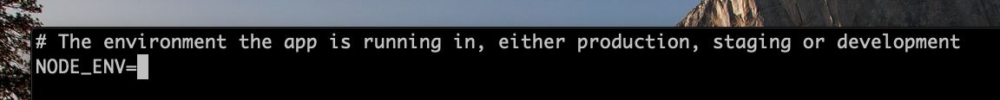
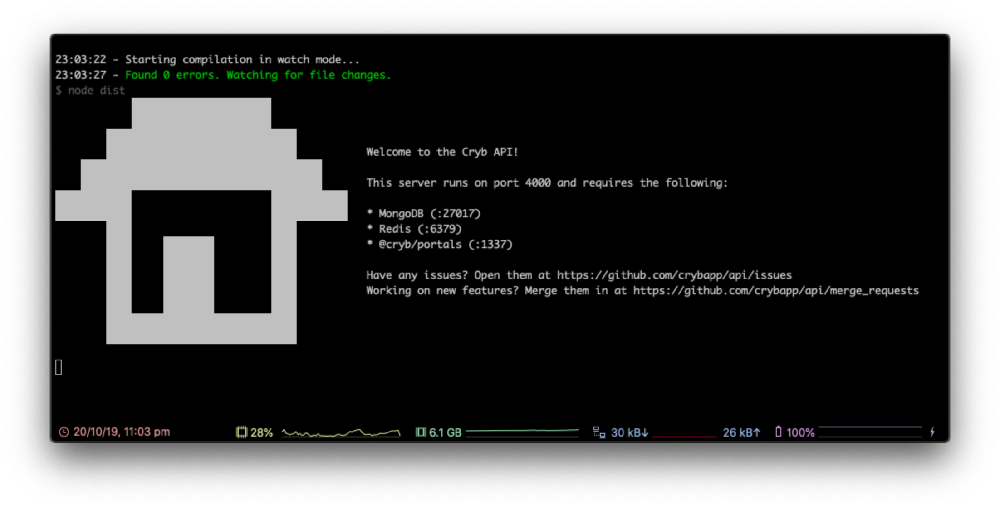

# Setting up API
API will handle requests from our client, in this case `@cryb/web`, such as creating rooms or sending messages.

## Docs
* [Pre-setup requirements](#pre-setup-requirements)
* [Cloning API](#cloning-api)
* [Installing Dependencies](#installing-dependencies)
* [Setting up environment variables](#setting-up-environment-variables)
* [Running API](#running-api)
* [Next step](#next-step)

## Pre-setup requirements
**If you've already setup a Discord application, you can skip this step and continue to [Cloning API](#cloning-api)**

You'll need to create an application with Discord to setup and use `@cryb/api`. There's a guide for that [here](../discord.md), so if you haven't got a Discord application created, get that done now as you'll need a client id and client secret to finish this guide!

## Cloning API

First, we'll need to clone `@cryb/api` from GitHub. In your terminal, type the following and hit enter:

```sh
git clone https://github.com/crybapp/api.git
```

This will clone all our API code into a folder called `api`. Let's enter that folder using `cd api`.

## Installing Dependencies

Once we're in the API folder, we'll need to install the dependencies that are required to run API. Simply run `yarn` in your Terminal and all the dependencies are downloaded and installed like magic.

## Setting up environment variables

Now we'll need to setup our `.env` file. Our environment file will dictate everything from URLs of other Cryb services to Discord client secrets which API needs to to able to run on your system. 

Let's copy the example `.env` file so it's easier to get started by running the command below:

```sh
cp .env.example .env
```

This will copy the `.env.example` file to `.env`. Now let's edit that file. You can use any text editor of your choice, we'll use Vim in this case. Just run:

```sh
vi .env
```

Now, press `i` to go into insert mode. Let's first of all fill in `NODE_ENV`. Position your cursor using the up, down, left and right arrows on your keyboard so the block cursor is positioned after the `=` after `NODE_ENV`, like below:



Let's write `development` to show we're running `@cryb/api` in Development mode. If you're running `@cryb/api` in production, on a [MacStadium](https://www.macstadium.com/) server for example, write `production`.

You'll need to do this for the rest of the unset values in the `.env` file. Use the handy table below to decide what you'll need to enter for each file:

| **Variable Name**       | **Description**                                                                    | **Recommended Value**                                               |
|-------------------------|------------------------------------------------------------------------------------|---------------------------------------------------------------------|
| `NODE_ENV`              | Used for setting the environment of `@cryb/api`                                    | development                                                         |
| `PORT`                  | Used for setting the port `@cryb/api` will listen on                               | 4000                                                                |
| `JWT_KEY`               | Used for signing / verifying client tokens                                         | *A long, random string with a mix of capitals, numbers and symbols* |
| `PORTALS_API_URL`       | The base URL of `@cryb/portals`                                                    | http://localhost:1337                                               |
| `PORTALS_API_KEY`       | Used for signing / verifying transport tokens to `@cryb/portals`                   | *See `JWT_KEY`*                                                     |
| `APERTURE_WS_URL`       | The WebSocket URL of `@cryb/aperture`                                              | ws://localhost:1337                                                 |
| `APERTURE_WS_KEY`       | Used for signing / verifying WebSocket tokens to `@cryb/aperture`                  | *See `JWT_KEY`*                                                     |
| `MONGO_URI`             | The URI of the MongoDB database                                                    | mongodb://localhost:27017/cryb                                      |
| `REDIS_URI`             | The URI of the Redis database                                                      | redis://localhost:6379                                              |
| `DISCORD_CLIENT_ID`     | The client ID of the Discord Oauth2 application                                    | *N/A*                                                               |
| `DISCORD_CLIENT_SECRET` | The client secret of the Discord Oauth2 application                                | *N/A*                                                               |
| `DISCORD_CALLBACK_URL`  | The callback URL for Discord Oauth2 application that should be sent to `@cryb/web` | http://localhost:3000/auth/discord                                  |
| `DISCORD_OAUTH_ORIGINS` | A list of comma-separated origins that Oauth2 logins should be accepted from       | http://localhost:3000                                               |

Once we've got that out of the way, simply press the Escape key on your keyboard and write `:wq` to save and exit Vim.

## Running API
Now everything is setup, let's try run `@cryb/api`. All you need to run is `yarn dev`. This should start API in watch mode. If everything worked, you'll see the following:



If you see this - congrats! API is successfully running. If you're having any issues, try going through this page again. If that doesn't help, let us know in a [GitHub issue](https://github.com/crybapp/api/issues) or in #tech-support in our [Discord server](https://discord.gg/ShTATH4).

## Next step
Next we'll setup `@cryb/web`: [Setting up Web](./web.md).