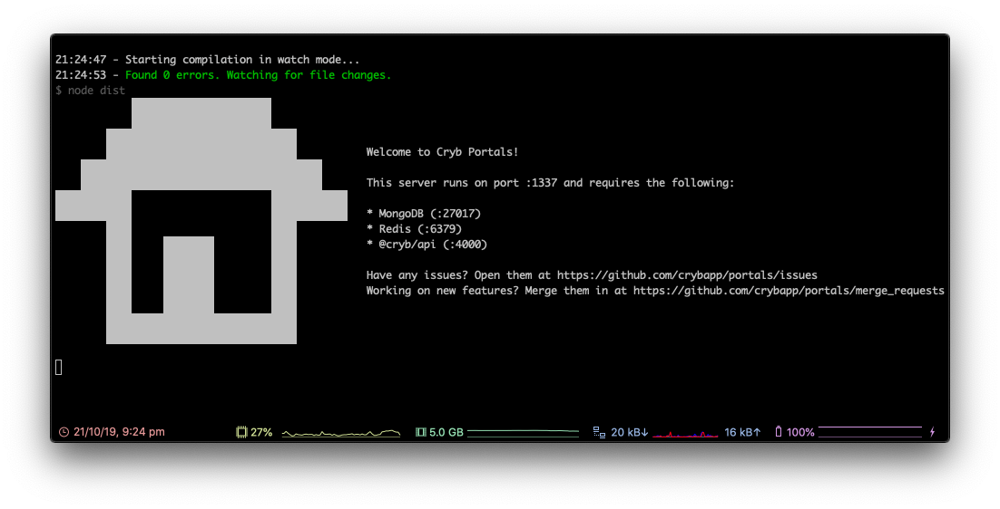

# Setting up Portals
Portals is used as the microservice that queues, creates and destroys VM instances. Controller events sent from `@cryb/web` are also proxied through Portals to each VM instance (Portal).

## Docs

* [Cloning Portals](#cloning-portals)
* [Installing Dependencies](#installing-dependencies)
* [Setting up environment variables](#setting-up-environment-variables)
* [Running Portals](#running-portals)
* [Next step](#next-step)

## Cloning Portals
*If you're continuing from [Setting up Web](./web.md), you'll need to run `cd ..` to return to the root `cryb` directory.*

First, we'll need to clone `@cryb/portals` from GitHub. In your terminal, type the following and hit enter:

```sh
git clone https://github.com/crybapp/portals.git
```

This will clone all our Portals code into a folder called `portals`. Let's enter that folder using `cd portals`.

## Installing Dependencies

Now that we're in the Portals folder, we'll need to install the dependencies that are required to run Portals. Simply run `yarn` in your Terminal and all the dependencies are downloaded and installed!

## Setting up environment variables

Now we'll need to setup our `.env` file. Our environment file will dictate everything from URLs of other Cryb services which Portals needs to to able to run on your system. 

Let's copy the example `.env` file so it's easier to get started by running the command below:

```sh
cp .env.example .env
```

This will copy the `.env.example` file to `.env`. Now let's edit that file. You can use any text editor of your choice, we'll use Vim in this case. Just run:

If you followed onto this tutorial from [Setting up API](./api.md), it should be easier to setup `@cryb/portals`'s environment variables. If you didn't read the tutorial for `@cryb/api`, and you're not sure how to setup the environment variables for this deployment, [check here](./api.md#setting-up-environment-variables) for more help.

Here's a handy table below to decide what you'll need to enter for each file:

| **Variable Name** | **Description**                                                | **Recommended Value**                                               |
|-------------------|----------------------------------------------------------------|---------------------------------------------------------------------|
| `NODE_ENV`        | Used for setting the environment of `@cryb/portals`            | development                                                         |
| `PORT`            | Used for setting the port `@cryb/portals` will listen on       | 1337                                                                |
| `API_URL `        | The base URL of `@cryb/api`                                    | http://localhost:4000                                               |
| `API_KEY `        | The same secure key located under `@cryb/api`'s `.env` file    | *A long, random string with a mix of capitals, numbers and symbols* |
| `PORTAL_KEY `     | The same secure key located under `@cryb/portal`'s `.env` file | *See `API_KEY`*                                                     |
| `MONGO_URI `      | The URI of the MongoDB database                                | mongodb://localhost:27017/cryb                                      |
| `REDIS_URI `      | The URI of the Redis database                                  | redis://localhost:6379     

## Running Portals
Now everything is setup, let's try run `@cryb/portals`. All you need to run is `yarn dev`. This should start Portals in watch mode. If everything worked, you'll see the following:



If you're having issues, let us know in a [GitHub issue](https://github.com/crybapp/portals/issues) or in #tech-support in our [Discord server](https://discord.gg/ShTATH4).

## Next step
Next we'll setup `@cryb/portal`: [Setting up Portal](./portal.md).
