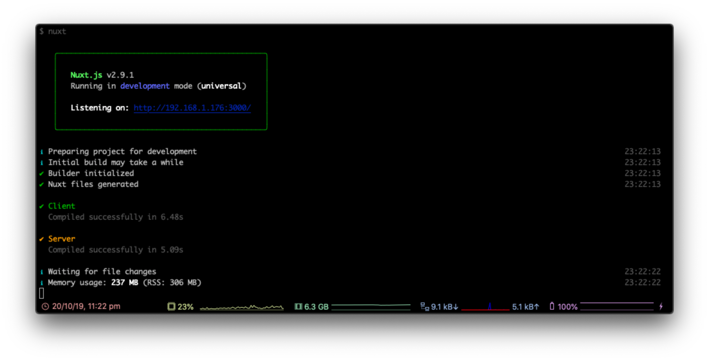
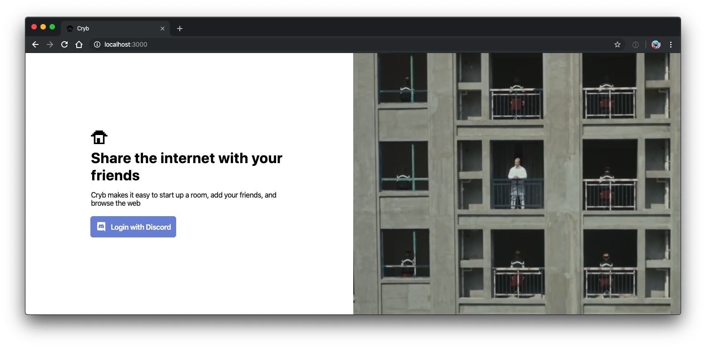

# Setting up Web
Web is used as our primary client for interacting with `@cryb/api` and in some cases `@cryb/aperture`.

## Docs

* [Cloning Web](#cloning-web)
* [Installing Dependencies](#installing-dependencies)
* [Setting up environment variables](#setting-up-environment-variables)
* [Running Web](#running-web)
* [Next step](#next-step)

## Cloning Web
*If you're continuing from [Setting up API](./api.md), you'll need to run `cd ..` to return to the root `cryb` directory.*

First, we'll need to clone `@cryb/web` from GitHub. In your terminal, type the following and hit enter:

```sh
git clone https://github.com/crybapp/web.git
```

This will clone all our Web code into a folder called `web`. Let's enter that folder using `cd web`.

## Installing Dependencies

Now that we're in the Web folder, we'll need to install the dependencies that are required to run Web. Simply run `yarn` in your Terminal and all the dependencies are downloaded and installed!

## Setting up environment variables

Now we'll need to setup our `.env` file. Our environment file will dictate everything from URLs of other Cryb services which Web needs to to able to run on your system. 

Let's copy the example `.env` file so it's easier to get started by running the command below:

```sh
cp .env.example .env
```

This will copy the `.env.example` file to `.env`. Now let's edit that file. You can use any text editor of your choice, we'll use Vim in this case. Just run:

If you followed onto this tutorial from [Setting up API](./api.md), it should be easier to setup `@cryb/web`'s environment variables. If you didn't read the tutorial for `@cryb/api`, and you're not sure how to setup the environment variables for this deployment, [check here](./api.md#setting-up-environment-variables) for more help.

Here's a handy table below to decide what you'll need to enter for each file:

| **Variable Name** | **Description**                                     | **Recommended Value** |
|-------------------|-----------------------------------------------------|-----------------------|
| `NODE_ENV`        | Used for setting the environment of `@cryb/web`     | development           |
| `API_WS_URL`      | The WebSocket URL of `@cryb/api`                    | ws://localhost:4000   |
| `API_BASE_URL`    | The base URL of `@cryb/api`                         | http://localhost:4000 |
| `WEB_BASE_URL`    | The base URL of `@cryb/web`                         | http://localhost:3000 |
| `COOKIE_DOMAIN`   | The domain that should be used to set cookies under | localhost             |
| `HOST`            | The host `@cryb/web` should run on                  | 0.0.0.0               |
| `NUXT_PORT`       | The port `@cryb/web` should listen on               | 3000                  |

## Running Web
Now everything is setup, let's try run `@cryb/web`. All you need to run is `yarn dev`. This should start Web in watch mode. If everything worked, you'll see the following:



Now, let's go to http://localhost:3000 in our browser to see if Web is running properly. If it is, you'll see the default landing page:



You should be able to login with Discord, and then create and delete rooms. If you can - congrats! Web is successfully running.

If you're having any issues, we have a couple things you can try doing, see below:

* **If the web page isn't loading**, try exiting the Web process in your terminal by pressing `Ctrl+C`. Try running the Web process again with `yarn dev`.
* **If `Login with Discord` isn't working**, make sure `@cryb/api` is running in a separate tab.

If these don't help, let us know in a [GitHub issue](https://github.com/crybapp/web/issues) or in #tech-support in our [Discord server](https://discord.gg/ShTATH4).

## Next step
Next we'll setup `@cryb/portals`: [Setting up Portals](./portals.md).
